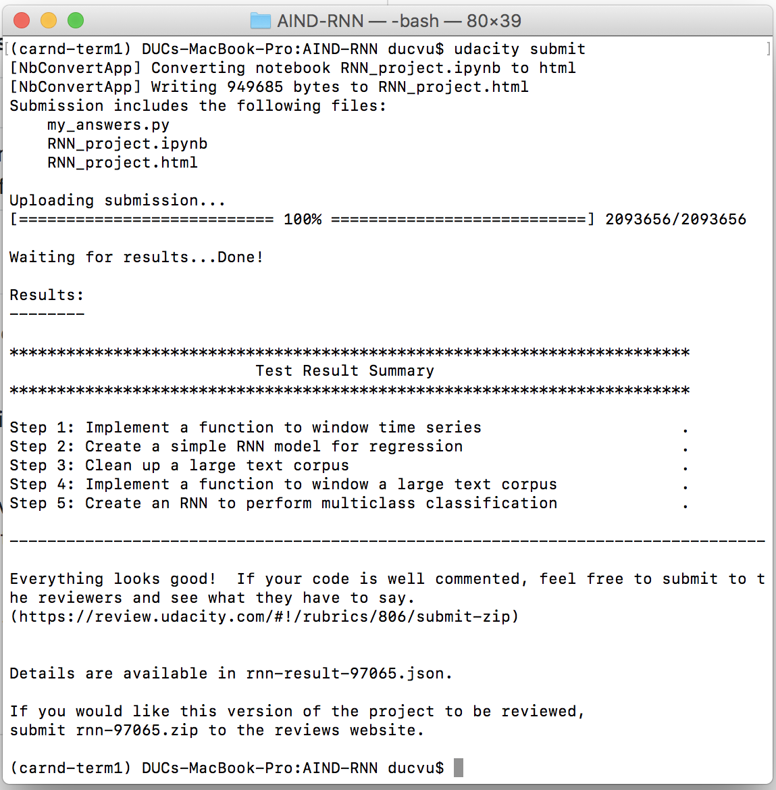

# Recurrent Neural Networks course project: time series prediction and text generation

## Accelerating the Training Process 

If your code is taking too long to run, you will need to either reduce the complexity of your chosen RNN architecture or switch to running your code on a GPU.  If you'd like to use a GPU, you have two options:

#### Build your Own Deep Learning Workstation

If you have access to a GPU, you should follow the Keras instructions for [running Keras on GPU](https://keras.io/getting-started/faq/#how-can-i-run-keras-on-gpu).

#### Amazon Web Services

Instead of a local GPU, you could use Amazon Web Services to launch an EC2 GPU instance. (This costs money.)

## Rubric items

#### Files Submitted

| Criteria       		|     Meets Specifications	        			            | 
|:---------------------:|:---------------------------------------------------------:| 
| Submission Files      |  RNN_project.ipynb, my_answers.py --> both the completed notebook  RNN_project.ipynb as well as all completed python functions requested in the main notebook RNN_project.ipynb (TODO items) should be copied into this python script and submitted for grading.		|

#### Step 1:  Implement a function to window time series
| Criteria       		|     Meets Specifications	        			            | 
|:---------------------:|:---------------------------------------------------------:| 
| Window time series data. |  The submission returns the proper windowed version of input time series of proper dimension listed in the notebook.  |

#### Step 2: Create a simple RNN model using keras to perform regression

| Criteria       		|     Meets Specifications	        			            | 
|:---------------------:|:---------------------------------------------------------:| 
| Build an RNN model to perform regression. |  The submission constructs an RNN model in keras with LSTM module of dimension defined in the notebook.        |

#### Step 3: Clean up a large text corpus

| Criteria       		|     Meets Specifications	        			            | 
|:---------------------:|:---------------------------------------------------------:| 
| Find and remove all non-english or punctuation characters from input text data.  The submission removes all non-english / non-punctuation characters.  |

#### Step 4: Implement a function to window a large text corpus

| Criteria       		|     Meets Specifications	        			            | 
|:---------------------:|:---------------------------------------------------------:| 
| Implement a function to window input text data| The submission returns the proper windowed version of input text of proper dimension listed in the notebook.  |

#### Step 5: Create a simple RNN model using keras to perform multiclass classification

| Criteria       		|     Meets Specifications	        			            | 
|:---------------------:|:---------------------------------------------------------:| 
| Build an RNN model to perform multiclass classification. |  The submission constructs an RNN model in keras with LSTM module of dimension defined in the notebook.        |

#### Step 6: Generate text using a fully trained RNN model and a variety of input sequences
| Criteria       		|     Meets Specifications	        			            | 
|:---------------------:|:---------------------------------------------------------:| 
| Generate text using a trained RNN classifier.   | The submission presents examples of generated text from a trained RNN module.  The majority of this generated text should consist of real english words. |

## Submission
Before submitting your solution to a reviewer, you are required to submit your project to Udacity's Project Assistant, which will provide some initial feedback.  

The setup is simple.  If you have not installed the client tool already, then you may do so with the command `pip install udacity-pa`.  

To submit your code to the project assistant, run `udacity submit` from within the top-level directory of this project.  You will be prompted for a username and password.  If you login using google or facebook, visit [this link](https://project-assistant.udacity.com/auth_tokens/jwt_login) for alternate login instructions.

This process will create a zipfile in your top-level directory named rnn-<id>.zip.  This is the file that you should submit to the Udacity reviews system.

